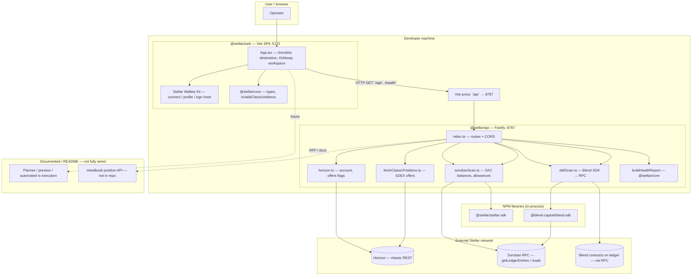
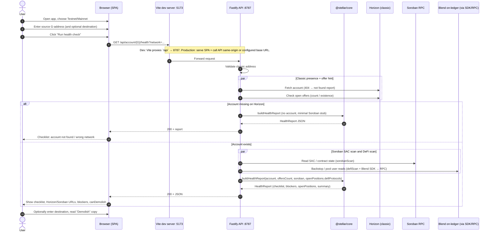

# Orbitway — architecture diagrams

Diagrams reflect the **monorepo layout** ([README.md](../README.md)), **API** ([services/api/README.md](../services/api/README.md)), **product scope** ([ORBITWAY_USECASES_AND_COMPONENTS.md](./ORBITWAY_USECASES_AND_COMPONENTS.md)), and **current code** in `apps/web`, `services/api`, and `packages/core`.

**Note:** The root README “production requirements” table may lag the codebase (e.g. DeFi: `scanDefiProtocols` runs on `GET .../health`). These diagrams follow the **implemented** health path unless labeled as planned.

---

## 1. High-level components and interactions

Internal packages, external Stellar services, and documented-but-not-yet-wired pieces.

### Legend

- **Solid arrows:** implemented request/data flow for the current vertical slice.
- **Dashed arrows:** described in docs or README as future work (planner, external position API, automated signed teardown).

---

## 2. Sequence diagram — user journey (current SPA)

Default flow: network + optional wallet connect + source G-address (+ optional destination) → **read-only** `GET .../health` → checklist. Demolish / merge / per-blocker signed fixes remain future work.

### Other API routes (not shown in the sequence above)

The API also exposes split endpoints for progressive or alternate clients:

- `GET /api/account/:accountId/horizon`
- `GET /api/account/:accountId/offers`
- `POST /api/account/:accountId/soroban-scan` (body: `horizonAccount`)

The current `App.tsx` health flow uses the monolithic **`GET /api/account/:accountId/health`** only.

---

## Rendering

- **GitHub / GitLab:** native Mermaid in markdown.
- **VS Code / Cursor:** Mermaid preview extensions, or paste into [mermaid.live](https://mermaid.live) for PNG/SVG export.
