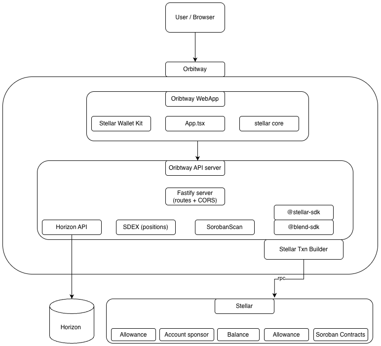
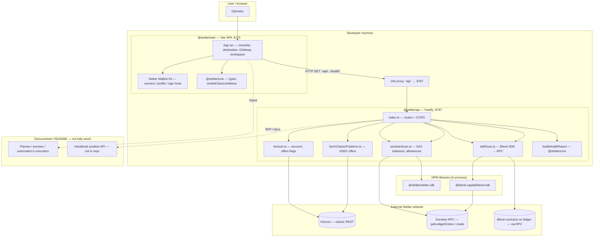
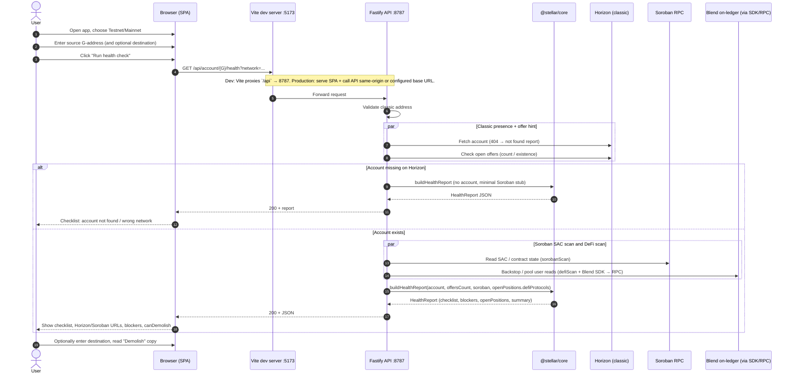

# Orbitway Technical Overview

This document describes the current implementation of the Orbitway monorepo: tech stack, local setup, runtime boundaries, and request/data flow. It should be read alongside [ARCHITECTURE_DIAGRAMS.md](./ARCHITECTURE_DIAGRAMS.md), which remains the visual reference for component interactions.

## 1. Purpose

Orbitway is a Stellar account inspection and cleanup application. The current repo implements:

- a React SPA for running account health checks and triggering selected classic cleanup actions
- a Fastify API that aggregates Horizon, Soroban RPC, and selected DeFi reads
- a shared TypeScript package containing health-report types and pure decision logic

The codebase is intentionally split so that:

- network I/O lives in the API or the browser wallet layer
- domain rules live in `@stellar/core`
- UI state and signing flow live in `@stellar/web`

## 2. Tech Stack

### Workspace layout

The repo uses npm workspaces declared in [package.json](../package.json).

| Workspace | Path | Role |
|---|---|---|
| `@stellar/web` | `apps/web` | Browser SPA for scanning accounts, showing blockers, connecting wallets, and signing supported cleanup transactions |
| `@stellar/api` | `services/api` | Read-oriented backend-for-frontend that talks to Horizon, Soroban RPC, and selected protocol SDKs |
| `@stellar/core` | `packages/core` | Shared types and pure health/blocker logic used by both web and API |

### Languages and tooling

| Area | Stack |
|---|---|
| Language | TypeScript across all workspaces |
| Package manager | npm workspaces |
| Node runtime | Node.js 20+ |
| Dev runner | `tsx watch` for the API, Vite for the SPA |
| Build tool | TypeScript compiler for `api` and `core`, Vite for `web` |

### Frontend

| Package | Use |
|---|---|
| `react` / `react-dom` | SPA rendering |
| `vite` | Dev server and web build |
| `@vitejs/plugin-react` | React integration for Vite |
| `@creit.tech/stellar-wallets-kit` | Wallet connection and transaction signing |
| `@stellar/stellar-sdk` | Classic Stellar transaction building and selected RPC helpers |

### Backend

| Package | Use |
|---|---|
| `fastify` | HTTP API server |
| `@fastify/cors` | CORS support for the API |
| `@stellar/stellar-sdk` | Horizon and Soroban RPC access, asset and transaction helpers |
| `@blend-capital/blend-sdk` | Blend protocol read path for DeFi exposure checks |

### Shared domain layer

`@stellar/core` exports:

- report types such as `HealthReport`, `Blocker`, `SorobanScanResult`
- pure health analysis helpers such as `buildHealthReport`
- position helpers such as liquidity-pool extraction and protocol-surface metadata

Key entrypoint: [packages/core/src/index.ts](../packages/core/src/index.ts)

## 3. Repository Structure

```text
stellar/
├── apps/
│   └── web/               # Vite + React SPA
├── services/
│   └── api/               # Fastify API
├── packages/
│   └── core/              # Shared report/types/helpers
├── docs/
│   ├── ARCHITECTURE_DIAGRAMS.md
│   ├── ORBITWAY_USECASES_AND_COMPONENTS.md
│   └── TECHNICAL_OVERVIEW.md
└── package.json
```

Important files:

- [apps/web/src/App.tsx](../apps/web/src/App.tsx): main app UI, health workflow, blocker actions
- [apps/web/src/walletKit.ts](../apps/web/src/walletKit.ts): wallet-kit initialization and signing helpers
- [services/api/src/index.ts](../services/api/src/index.ts): API routes and composition layer
- [services/api/src/sorobanScan.ts](../services/api/src/sorobanScan.ts): SAC balance and allowance checks
- [services/api/src/defiScan.ts](../services/api/src/defiScan.ts): Blend backstop read path
- [packages/core/src/health.ts](../packages/core/src/health.ts): canonical health checklist and blocker generation

## 4. Local Setup

### Requirements

- Node.js `20+`
- npm `10+`

### Install

```bash
cd <WORK_DIRECTORY>
npm install
```

### Run locally

Start both the API and SPA:

```bash
npm run dev:all
```

Useful alternatives:

```bash
npm run dev       # web only, port 5173
npm run dev:api   # api only, port 8787
npm run build
npm run typecheck
```

### Default local ports

| Service | Port | Notes |
|---|---|---|
| SPA (`@stellar/web`) | `5173` | Vite dev server |
| API (`@stellar/api`) | `8787` | Fastify server |

The SPA proxies `/api` requests to the local API through [apps/web/vite.config.ts](../apps/web/vite.config.ts).

## 5. Environment Configuration

### API environment

Environment variables documented in [services/api/README.md](../services/api/README.md):

| Variable | Purpose |
|---|---|
| `HORIZON_URL` | Override Horizon base URL for all requests |
| `SOROBAN_RPC_URL` | Override Soroban RPC base URL for all requests |
| `SOROBAN_ALLOWANCE_SPENDERS` | Comma-separated Soroban spender contract IDs used for allowance checks |
| `SOROSWAP_BEARER_TOKEN` | Enables server-side Soroswap quote/build flow |
| `SOROSWAP_API_BASE` | Override Soroswap API host |
| `HOST` / `PORT` | API bind address and port |
| `LOG_UPSTREAM` / `LOG_UPSTREAM_BODY` | Upstream request/response logging controls |

### Web environment

Current web-specific environment use:

| Variable | Purpose |
|---|---|
| `VITE_WALLETCONNECT_PROJECT_ID` | Enables WalletConnect module in Stellar Wallets Kit |

## 6. Architecture

The high-level component diagram:





Request Sequence:



### Web layer

`@stellar/web` is a client-rendered SPA that:

- captures user input such as source account, network, and destination account
- calls API health endpoints
- renders grouped checklist rows and blockers from `HealthReport`
- builds or requests XDRs for supported classic cleanup flows
- uses Stellar Wallets Kit for client-side signing

The web app does not hold server secrets and does not proxy signing through the API.

### API layer

`@stellar/api` is a thin composition layer. It does not custody user keys. It is responsible for:

- validating request shape
- reading classic account state from Horizon
- reading Soroban state from RPC
- reading selected DeFi protocol state, currently Blend
- composing those slices into a normalized `HealthReport`

The API is not a generic planner or execution engine. It is currently a read-oriented BFF plus a small number of helper routes such as order-book lookup and Soroswap quote/build.

### Shared domain layer

`@stellar/core` defines the canonical health model. This is where the codebase decides:

- which checklist rows exist
- which conditions block account demolition
- how open positions are represented
- how classic, Soroban, and DeFi findings collapse into blocker codes

This separation keeps business logic testable and avoids duplicating rules between API and UI.

## 7. External Dependencies and Network Boundaries

### Horizon

Horizon is used for classic Stellar reads:

- account JSON
- trustline and balance inspection
- SDEX offers
- claimable balances
- classic liquidity-pool balances
- destination-account existence checks

Default endpoints are network-specific unless `HORIZON_URL` is set.

### Soroban RPC

Soroban RPC is used for:

- Stellar Asset Contract balance checks
- SAC allowance checks against configured spender contracts
- protocol-backed reads such as Blend through SDK + RPC

Default endpoints are network-specific unless `SOROBAN_RPC_URL` is set.

### Protocol integrations

Current protocol-specific integration:

- Blend via `@blend-capital/blend-sdk` for reward-zone/backstop exposure checks

Current non-integrated-but-documented surfaces:

- Aquarius
- Soroswap positions and unwind flows beyond the existing quote/build helper

## 8. Request and Data Flow

### Primary health-check flow

At a high level:

1. The SPA sends `GET /api/account/:accountId/health?network=...`.
2. The API fetches Horizon account state and classic positions.
3. In parallel, the API runs Soroban SAC checks and DeFi surface checks.
4. The API calls `buildHealthReport` from `@stellar/core`.
5. The SPA renders `checklist`, `blockers`, `summary`, and `openPositions`.

See the sequence diagram in [ARCHITECTURE_DIAGRAMS.md](./ARCHITECTURE_DIAGRAMS.md#2-sequence-diagram--user-journey-current-spa).

### Supporting routes

Additional API routes serve focused read paths or helper flows:

| Route | Purpose |
|---|---|
| `GET /api/account/:accountId/horizon` | Raw Horizon account payload for debugging/advanced flows |
| `GET /api/account/:accountId/offers` | Full classic SDEX offers for cancel flows |
| `GET /api/account/:accountId/claimable-balances` | Inbound claimable balance IDs |
| `GET /api/order-book` | Classic credit-to-native order book lookup |
| `GET /api/soroswap/status` | Whether Soroswap helper is configured |
| `POST /api/soroswap/swap-xdr` | Build Soroswap swap XDR through server-side bearer auth |

## 9. Stellar Account State Coverage

Orbitway identifies account-state objects that may block cleanup, asset recovery, or account merge.

| Area | Current / Planned Handling |
|---|---|
| Sponsorship | Detects sponsorship-related state such as `num_sponsoring` and sponsored entries. Where safe, Orbitway builds `RevokeSponsorship` operations in batches. Large accounts are handled through multi-pass processing: execute batch, refresh state, recalculate remaining sponsored entries, and continue only after user review. |
| Multisig | Inspects signer weights, threshold configuration, and threshold mismatches. If authority permits, Orbitway prepares `SetOptions` operations to remove extra signers by setting signer weight to `0` and adjusts thresholds into a merge-safe configuration. |
| Trustlines | Removes zero-balance classic trustlines. Positive-balance trustlines are handled through sale, transfer, payout, or conversion before `ChangeTrust(0)`. |
| Account Data | Detects account data entries and removes them through `ManageData` delete operations, including batch handling for large accounts. |
| Claimable Balances | Detects inbound claimable balances and includes claim actions where the account can claim them. Users should be able to select balances instead of claiming all by default. |
| DEX Offers | Discovers open offers through Horizon. Offers are cancelled before trustline removal because active offers can block cleanup. |
| LP Shares | Detects classic AMM / LP share balances through Horizon. LP shares are treated as blockers unless they can be safely withdrawn or unwound. |
| Account Merge Readiness | Derives readiness from balances, trustlines, offers, sponsorships, signers, thresholds, unsupported positions, destination validity, and user approval of final irreversible action. |

Cleanup planning classifies each detected account-state object as one of four categories:

- ready to clean
- needs user review
- requires another action first
- unsupported or unsafe to close

Unsupported or unverifiable state blocks account merge.

## 10. Cleanup Execution Details

Orbitway converts account state into an ordered cleanup plan. The goal is not just to detect blockers, but to explain what happens next and prepare the correct action sequence.

### Sponsorship removal

For sponsored entries that can be discovered through Horizon, Orbitway prepares `RevokeSponsorship` operations. For accounts with many sponsored entries, cleanup is split into multiple passes.

Each pass follows this flow:

1. Detect sponsored entries.
2. Build a safe revoke batch.
3. Show the user what will be revoked.
4. Prepare transaction XDR.
5. User signs.
6. Submit transaction.
7. Refresh account state.
8. Continue only if more sponsored entries remain.

If a sponsored entry cannot be safely identified or revoked, it remains a blocker.

### Multisig and threshold cleanup

Orbitway scans current signer configuration, signer weights, and account thresholds.

If the connected signer has enough authority, Orbitway can prepare `SetOptions` operations to:

- remove extra signers by setting their weight to `0`
- adjust low, medium, and high thresholds where required
- move the account toward a merge-safe configuration
- refresh state after each signer or threshold update

For multisig accounts, Orbitway will support transaction assembly so multiple required signers can sign before submission. This prevents incomplete signer cleanup from leaving the account in an unsafe state.

### Trustline and balance cleanup

Trustline cleanup is handled in two paths:

- zero-balance trustlines: removed directly through `ChangeTrust(0)`
- positive-balance trustlines: routed through sale, transfer, payout, or conversion before trustline removal

If a token cannot be sold, transferred, or routed safely, it remains a blocker and account merge is disabled.

### Account merge and destination handling

Account merge is treated as the final step, not a generic cleanup action.

Before merge, Orbitway verifies:

- no blocking non-native balances remain
- no required trustlines remain
- no open offers remain
- no required claimable balances remain unresolved
- no required data entries remain
- signers and thresholds allow account merge
- sponsorship state does not block cleanup
- no unsupported Soroban or DeFi positions remain
- destination account is valid
- user has reviewed the irreversible merge action

Users can choose a Stellar wallet or exchange destination. For exchange destinations, Orbitway will support memo / tag handling where required.

If the final destination cannot receive `ACCOUNT_MERGE`, Orbitway will support a temporary mediator-account flow: the original account merges into a temporary account, and recovered funds are then sent to the final destination through a standard payment operation.

## 11. Soroban, DeFi, and Routing Support

Orbitway's Soroban and DeFi support is built in stages. The system should never allow account merge when unsupported Soroban or DeFi state cannot be safely verified.

| Area | Integration Surface | Current / Planned Handling |
|---|---|---|
| SAC balances | Soroban RPC and token contract reads | Detect SAC token balances and include them in account health reports. |
| Allowances and authorizations | Soroban RPC and configured contract checks | Show configured allowances today. Expand toward automatic discovery of active allowances and revocation support. |
| Blend | Soroban RPC, simulations, and `@blend-capital/blend-sdk` | Current implementation provides read-only Blend backstop exposure visibility. Planned adapters will support position close / withdraw flows where reliable. |
| Aquarius | Soroban contract calls, pool/router reads, and indexer support where available | Position discovery may require contract-level reads. Planned adapters will support unwind flows where technically feasible. |
| Soroswap | HTTPS API and TypeScript SDK | Used for quotes, pool metadata, routing, and transaction building through the API service. |
| Classic SDEX / AMM | Horizon and liquidity pool endpoints | Used for offer cancellation, classic LP detection, LP withdrawal, and route discovery where available. |

### DeFi unwind adapter flow

For each supported protocol, Orbitway will implement an adapter pattern:

1. Detect whether the account has an active position.
2. Fetch position metadata through RPC, SDK, protocol API, or indexer.
3. Show position details and unwind requirements.
4. Simulate or preview the close / withdraw action where supported.
5. Generate transaction XDR.
6. Require user review and wallet-side signing.
7. Refresh account state after execution.

Initial DeFi unwind targets include Blend, Aquarius, Soroswap, and other major Stellar / Soroban protocols where position detection and safe closure can be supported reliably.

### Portfolio liquidation and target-asset conversion

Orbitway will support portfolio liquidation into XLM by default and later into user-selected target assets where routes are available. The routing layer will evaluate available sources such as:

- Classic SDEX order books
- Soroswap routes
- Soroban-supported liquidity routes
- other available protocol routes where reliable

For each route, Orbitway will show:

- source asset
- target asset
- estimated output
- slippage
- route path
- unsupported assets
- whether the conversion is required for account merge

For Soroban SAC assets, Orbitway will discover balances, check available routes, show estimated output, and prepare swap transactions only after user confirmation. If no safe route exists, the asset is marked as unsupported and account merge remains blocked.

### Allowance inspection without demolishing

Orbitway will include an inspect-only mode for Soroban allowances and authorizations.

Users can scan active allowances without starting the cleanup or account merge flow. This mode will show known spender approvals, token contracts, allowance amounts, expiry where available, and whether revocation is supported.

Allowance revocation can then be offered as a separate cleanup action.

### Soroban parity path

Orbitway will move toward Soroban parity in stages:

1. SAC balance scanning
2. Configured allowance checks
3. Broader allowance and authorization discovery
4. Soroban asset routing and conversion
5. DeFi position detection
6. Protocol-specific unwind adapters
7. Merge-readiness checks that include Soroban state

Until parity is reached, unsupported Soroban state will remain visible as a blocker rather than being hidden.

## 12. Wallet Signing, Multisig, and Transaction Model

Orbitway follows a non-custodial signing model. Account scans are read-only and do not require wallet approval. Cleanup actions require explicit user review and wallet-side signing.

Orbitway's default signing path is wallet-based through Stellar Wallets Kit.

| Integration | Purpose | Status |
|---|---|---|
| `@creit.tech/stellar-wallets-kit` | Wallet connection and client-side signing through Freighter, WalletConnect, and other Stellar wallets. | Integrated |
| Multisig transaction assembly | Prepare transactions that can collect multiple signatures before submission. | Planned |
| Local signing mode | Optional local-only signing for advanced or legacy accounts. | Planned |
| Server-side signing | Not used. Private keys are never sent to the backend. | Not supported |

Current write flow is intentionally non-custodial:

- XDRs are constructed in the client for supported classic operations
- user signatures are gathered through Stellar Wallets Kit
- the API does not receive user secret keys
- the API may use server-side credentials only for third-party service access such as Soroswap quote/build

Implemented classic write helpers include:

- remove data entries
- cancel SDEX offers
- withdraw LP shares
- claim inbound claimable balances
- remove empty trustlines
- remove extra `ed25519_public_key` signers
- set merge-friendly thresholds
- perform plain `ACCOUNT_MERGE` to an existing destination account

### Direct secret key input

For advanced or legacy accounts, Orbitway may support direct secret key input as an optional local-only signing mode. If implemented:

- secret keys are never sent to the backend
- secret keys are not stored on Orbitway servers
- keys are not persisted by default
- the key is used only in the local browser session
- the user still reviews each transaction before signing

This mode will be clearly separated from the default wallet-based flow and marked as advanced.

### Multisig with multiple keys

For multisig accounts, Orbitway will support transaction assembly and multi-signature collection. The flow will be:

1. Generate cleanup transaction XDR.
2. Show required threshold and signer requirements.
3. Collect signatures from connected wallets or local signers.
4. Validate that the signature threshold is met.
5. Submit the transaction only after enough signatures are present.
6. Refresh account state before the next cleanup step.

This allows Orbitway to support multisig and legacy accounts without taking custody of user funds.

## 13. Current Limitations

The repo is not yet a full demolition planner/executor. The main technical gaps are:

- no mediator-account merge flow for exchanges/CEX destinations
- no full multisig signing workflow across multiple keys or wallets
- no general Soroban teardown parity
- no DeFi unwind transaction builders for Blend, Aquarius, or Soroswap LP positions
- no dry-run planner or sequential execution session model
- no automatic discovery of arbitrary Soroban-only assets or all active spender authorizations

These limits are described in more detail in:

- [README.md](../README.md)
- [ORBITWAY_USECASES_AND_COMPONENTS.md](./ORBITWAY_USECASES_AND_COMPONENTS.md)

## 14. Development Notes

When extending the codebase, keep these boundaries intact:

- add network reads to `services/api`
- keep report and blocker decisions in `packages/core`
- keep signing and interactive execution in `apps/web`

That separation matches the current implementation and the diagrams in [ARCHITECTURE_DIAGRAMS.md](./ARCHITECTURE_DIAGRAMS.md), and it is the cleanest path for future additions such as a planner, preview engine, or deeper Soroban protocol adapters.
