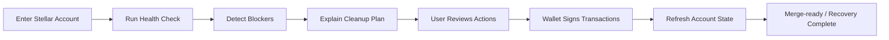
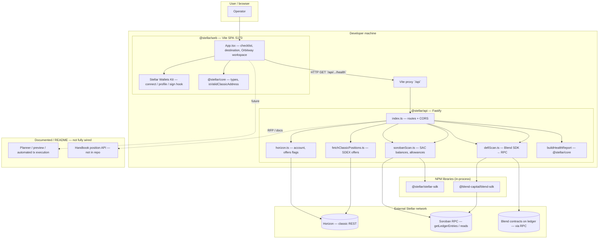
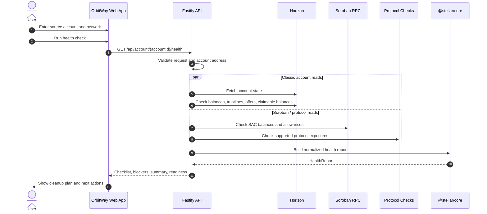
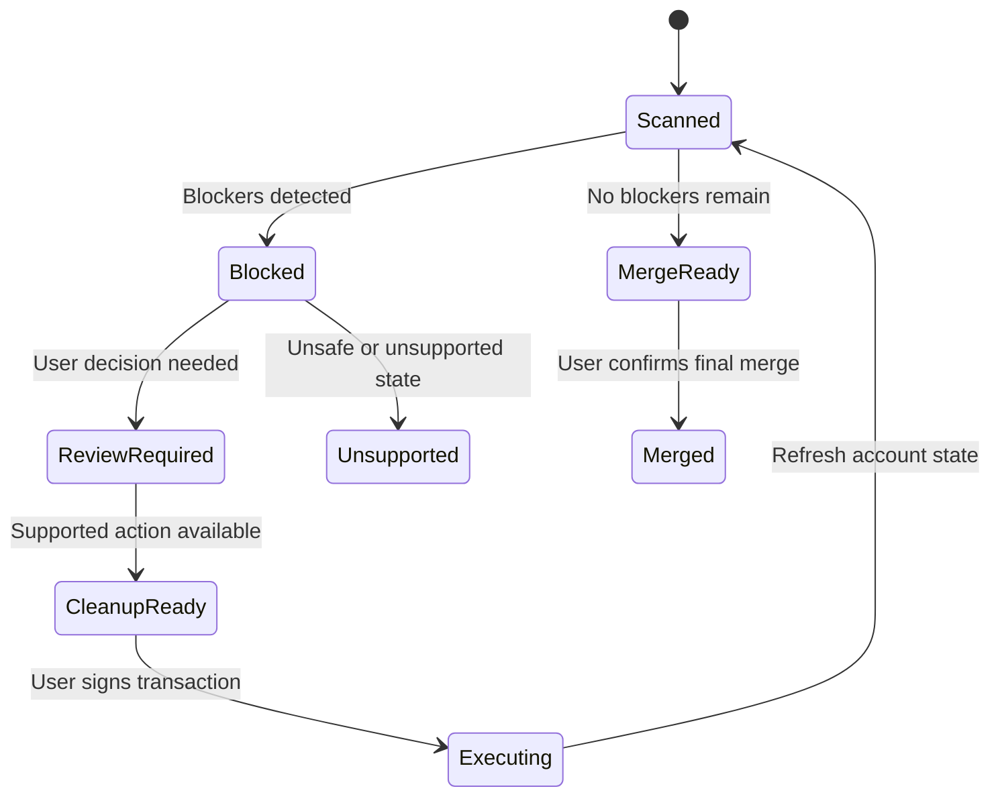

# OrbitWay Technical Overview

OrbitWay is a Stellar account inspection, cleanup, and recovery workflow application. It helps users scan a Stellar account, understand why it cannot be safely closed or merged, and move through the required cleanup steps to recover remaining value or reach a merge-ready state.

The technical problem OrbitWay addresses is that Stellar account state is distributed across multiple surfaces. A single account may contain native XLM, non-native trustlines, open SDEX offers, claimable balances, sponsorships, multisig signers, account data entries, classic liquidity-pool positions, Soroban assets, token allowances, or protocol-level exposure. Any of these can affect whether the account can be safely cleaned up or merged.

OrbitWay converts this fragmented state into a normalized account-health report. The report explains which parts of the account are clean, which objects are blocking cleanup, which actions require user review, and which states are currently unsupported or unsafe to close. The application is designed as a step-by-step cleanup workflow: scan the account, detect blockers, explain the cleanup plan, prepare supported actions, request wallet-side signing, refresh account state, and continue until the account is either merge-ready or clearly blocked.

The current implementation is structured as a TypeScript monorepo with three main runtime boundaries: a React/Vite web application, a Fastify API service, and a shared TypeScript core package. The web application owns the user workflow, wallet connection, transaction review, and signing flow. The API aggregates read-only network data from Horizon, Soroban RPC, and selected protocol integrations. The shared core package contains the health-report model, blocker types, and account-readiness logic used across the system.

OrbitWay is intentionally non-custodial. Account scans are read-only, private keys are never sent to the backend, and cleanup transactions require explicit user approval through wallet-side signing. Account merge is treated as the final irreversible step and is only enabled after supported blockers have been resolved and unsupported state has been ruled out or clearly surfaced.

The sections below first explain the user cleanup journey, then show the system architecture that supports it, followed by the safety model, implementation scope, account-health logic, limitations, and development details.

---

## 1. User Journey

The OrbitWay user journey begins with a source Stellar account. The user selects a network, enters the account address, and runs a health check. OrbitWay reads the account state from Stellar network services and returns a structured health report.

If blockers are found, OrbitWay groups them by category and explains the required next action. Some blockers may be directly removable, such as empty trustlines, account data entries, or open SDEX offers. Others may require review, such as positive-balance trustlines, claimable balances, multisig configuration, LP positions, Soroban assets, or DeFi exposure.

After the user reviews the cleanup plan, OrbitWay prepares supported transaction steps. The user signs each action through a wallet-based flow. After every transaction, OrbitWay refreshes account state and recalculates the remaining blockers. Account merge is only presented after the account is confirmed to be merge-ready.



---

## 2. System Architecture

OrbitWay is split into three main runtime boundaries: the web application, the API service, and the shared core package. This separation keeps network reads, domain rules, and signing interactions isolated from each other.

The web application manages the user interface, wallet connection, transaction review, and client-side signing. The API service performs read-oriented aggregation across Horizon, Soroban RPC, and selected protocol surfaces. The shared core package converts raw account state into a normalized health report with checklist rows, blockers, open positions, summary data, and merge-readiness signals.

This separation preserves the non-custodial signing model while allowing the API to centralize network reads and the shared core package to keep account-readiness rules reusable across the system.



---

## 3. Safety and Signing Model

OrbitWay follows a non-custodial signing model. Account scans are read-only and do not require wallet approval. Cleanup actions require explicit user review and wallet-side signing.

The default signing path uses Stellar Wallets Kit. Users connect a supported wallet, review the prepared action, sign the transaction client-side, and then OrbitWay refreshes account state after execution. The API does not receive user secret keys and does not sign user transactions.

Server-side credentials may be used only for third-party service access, such as configured Soroswap quote/build flows. They are not used to custody user funds or sign user transactions.

For advanced or legacy accounts, OrbitWay may support a local-only signing mode. If implemented, this mode should remain clearly separated from the default wallet flow. Secret keys should not be sent to the backend, should not be stored on OrbitWay servers, and should only be used in the local browser session after explicit user review.

For multisig accounts, future versions of OrbitWay should support transaction assembly and multi-signature collection. The flow should generate the cleanup transaction XDR, show threshold and signer requirements, collect enough signatures, submit only when the threshold is met, and refresh account state before continuing.

The safety rule is simple: if OrbitWay cannot safely inspect, remove, unwind, or verify an account-state object, the object remains visible as a blocker and account merge stays disabled.

---

## 4. Current Implementation Scope

The current repository is implemented as a TypeScript monorepo using npm workspaces.

| Workspace | Path | Role |
|---|---|---|
| `@stellar/web` | `apps/web` | Browser SPA for account scanning, blocker display, wallet connection, and supported cleanup actions |
| `@stellar/api` | `services/api` | Read-oriented backend-for-frontend for Horizon, Soroban RPC, and selected protocol reads |
| `@stellar/core` | `packages/core` | Shared health-report types, blocker logic, and account-readiness helpers |

The web app is built with React and Vite. It manages the account-health workflow, destination input, wallet connection, checklist rendering, blocker display, and supported classic cleanup actions. Wallet connection and signing are handled through Stellar Wallets Kit.

The API is built with Fastify. It validates requests, reads account state from Horizon, reads selected Soroban state through RPC, checks selected protocol surfaces such as Blend exposure visibility, and composes this data into the shared health model. Soroswap is currently represented through helper routes for status and swap-XDR construction where server-side bearer configuration is available; broader position discovery and unwind support remain future extensions.

The shared core package defines report types such as `HealthReport`, `Blocker`, and `SorobanScanResult`. It also contains pure health-analysis helpers such as `buildHealthReport`, which convert raw account state into checklist rows, blocker codes, open positions, summary information, and merge-readiness signals.

Key source files include:

| File | Purpose |
|---|---|
| `apps/web/src/App.tsx` | Main app UI, health workflow, blocker display, and supported actions |
| `apps/web/src/walletKit.ts` | Wallet-kit initialization and signing helpers |
| `services/api/src/index.ts` | API routes and composition layer |
| `services/api/src/sorobanScan.ts` | SAC balance and allowance checks |
| `services/api/src/defiScan.ts` | Blend read path |
| `packages/core/src/health.ts` | Canonical health checklist and blocker generation |

---

## 5. Network Read Surfaces

OrbitWay reads account state from multiple Stellar network surfaces and normalizes those results into a single health report.

Horizon is used for classic Stellar state, including account JSON, native and non-native balances, trustlines, SDEX offers, claimable balances, classic liquidity-pool balances, and destination-account existence checks. These reads allow OrbitWay to detect common blockers that affect cleanup and account merge readiness.

Soroban RPC is used for Soroban-facing checks such as Stellar Asset Contract balances, configured SAC allowance checks, and protocol-backed reads where supported. Selected protocol integrations, such as Blend exposure visibility, use SDK or RPC-backed reads to surface relevant account state.

---

## 6. Health Check Data Flow

The primary health-check flow begins when the web app sends a request to the API for a specific account and network. In local development, Vite proxies `/api` requests to the Fastify server. In production, the same flow can be served through a configured API base URL or same-origin deployment.

The API validates the account address and selected network, fetches classic account state from Horizon, runs Soroban and supported protocol checks where available, and passes the combined state into the shared health engine. The result is returned to the web app as a normalized `HealthReport`.



OrbitWay also exposes supporting API routes for focused read paths and helper flows:

| Route | Purpose |
|---|---|
| `GET /api/account/:accountId/horizon` | Returns the raw Horizon account payload for debugging or advanced flows |
| `GET /api/account/:accountId/offers` | Returns full classic SDEX offers for offer-cancel flows |
| `GET /api/account/:accountId/claimable-balances` | Returns inbound claimable balance IDs for claimable-balance handling |
| `GET /api/order-book` | Looks up classic credit-to-native order books |
| `GET /api/soroswap/status` | Checks whether the Soroswap helper is configured |
| `POST /api/soroswap/swap-xdr` | Builds Soroswap swap XDR through server-side bearer configuration |

---

## 7. Account Health and Blocker Model

OrbitWay’s core output is a normalized health report. This report converts raw account state into a clear account-readiness model.

The report combines account-level readiness with object-level cleanup status. At the account level, OrbitWay can show whether the account is blocked, cleanup-ready, unsupported, or merge-ready. At the object level, each detected state item can be marked as directly cleanable, review-required, dependent on another action, or unsupported.

A health report should include account summary data, checklist rows, blocker codes, object-level cleanup status, open positions, destination-readiness indicators, and merge-readiness signals. This makes the output usable by the web interface today and by future planner or execution-session flows.



OrbitWay currently focuses on these account-state categories:

| Area | Handling |
|---|---|
| Sponsorship | Detects sponsorship-related state and prepares revoke operations where safe |
| Multisig | Inspects signer weights and thresholds; prepares merge-safe signer cleanup where authority permits |
| Trustlines | Removes zero-balance trustlines; requires sale, transfer, payout, or conversion for positive balances |
| Account Data | Detects and removes account data entries through `ManageData` delete operations |
| Claimable Balances | Detects inbound claimable balances and includes claim actions where the account can claim them |
| DEX Offers | Discovers open offers through Horizon and cancels them before trustline removal |
| LP Shares | Detects LP share balances and blocks merge unless they can be safely withdrawn or unwound |
| Soroban / DeFi State | Detects supported state and blocks merge when unsupported or unverifiable state remains |
| Account Merge | Enables merge only after blockers are resolved and the destination is validated |

The health report identifies detected account-state objects and surfaces their cleanup status through blockers, checklist items, and readiness signals. Depending on the object type and current implementation support, OrbitWay may indicate that an action is available, that user review is required, that prerequisite steps must be completed first, or that the state is unsupported and prevents account merge.

---

## 8. Cleanup Planning and Execution

OrbitWay converts detected account state into an ordered cleanup plan. The cleanup plan is sequential rather than one-shot because every cleanup transaction can change the account state and affect the next available action.

For example, zero-balance trustlines can usually be removed directly, while positive-balance trustlines require sale, transfer, payout, or conversion before removal. Open offers must be cancelled before associated trustlines can be removed. Claimable balances may need to be claimed or reviewed. Sponsorship state may need to be revoked in batches. Multisig accounts may require signer and threshold changes before account merge is possible.

After each signed cleanup transaction, OrbitWay refreshes account state and rebuilds the health report. This prevents the app from relying on stale assumptions and allows the user to move through cleanup in controlled steps.

Account merge is treated as the final action. Before merge, OrbitWay verifies that no blocking balances, trustlines, offers, claimable balances, account data entries, sponsorship state, signer configuration issues, unsupported Soroban state, or DeFi positions remain. It also verifies that the destination account is valid and that the user has explicitly reviewed the irreversible merge action.

Destination validation includes checking whether the destination account exists and whether the selected destination can safely receive recovered funds. Direct `ACCOUNT_MERGE` should only be offered where the destination supports it; exchange or memo-based destinations require additional handling and remain part of the planned mediator-account flow.

The current implementation includes the following classic cleanup helpers:

| Cleanup helper | Status |
|---|---|
| Remove data entries | Supported |
| Cancel SDEX offers | Supported |
| Claim inbound claimable balances | Supported where the source account can claim them |
| Remove empty trustlines | Supported |
| Withdraw LP shares | Supported where classic LP data is available |
| Remove extra `ed25519_public_key` signers | Supported where authority permits |
| Set merge-friendly thresholds | Supported where authority permits |
| Plain `ACCOUNT_MERGE` | Supported for existing valid destination accounts |

---

## 9. Soroban and DeFi Boundary

OrbitWay’s Soroban and DeFi support is intentionally conservative. The current priority is safe detection and merge blocking, not full portfolio liquidation or generalized DeFi unwinding.

Where OrbitWay can safely detect Soroban balances, allowances, or protocol exposures, it should include them in the health report. Where it cannot safely inspect or unwind a position, it should mark the state as unsupported and prevent account merge. This approach avoids hiding complex state that could affect account cleanup.

Future extensions may include broader allowance discovery, allowance revocation, Soroban asset routing, Blend position close flows, Aquarius and Soroswap unwind support, and conversion into XLM or another user-selected destination asset. These are future extensions and should not be treated as required for the initial cleanup flow.

---

## 10. Current Limitations

The current repository is not yet a complete cleanup planner and execution engine. The main limitations are full multisig signing across multiple keys or wallets, general Soroban teardown parity, DeFi unwind transaction builders for Blend, Aquarius, or Soroswap LP positions, a dry-run planner, a sequential execution session model, and automatic discovery of arbitrary Soroban-only assets or all active spender authorizations.

The repository also does not yet include mediator-account merge support for exchange or CEX destinations that cannot directly receive `ACCOUNT_MERGE`. Until those flows are implemented, OrbitWay should continue to treat unsupported destination or account-state conditions conservatively.

OrbitWay should not automatically attempt cleanup for assets, contracts, signers, destinations, or protocol positions that it cannot fully inspect and explain. In those cases, the health report should show the blocker and prevent merge rather than generating a transaction.

---

## 11. Roadmap and Planned Enhancements

The current MVP focuses on account inspection, health reporting, blocker detection, and supported cleanup actions for common Stellar account states. Future development is centered on expanding cleanup coverage, improving execution workflows, and increasing visibility into complex account state while maintaining OrbitWay’s safety-first model.

Near-term enhancements include dry-run planning, guided execution sessions, fuller multisig workflows, expanded sponsorship and account-configuration cleanup, and broader Soroban asset, allowance, and authorization discovery.

Future protocol extensions can add additional Soroban cleanup capabilities, DeFi unwind support for protocols such as Blend, Aquarius, and Soroswap, route-based asset conversion and recovery flows, and mediator-account support for destinations that cannot directly receive account merges.

---

## 12. Testing and Validation

The shared health logic should remain testable through pure functions in `packages/core`. Tests should cover blocker generation, account-readiness decisions, unsupported-state handling, and the conversion of Horizon, Soroban, or protocol findings into a normalized health report.

API-level validation should cover request validation, missing-account behavior, upstream response handling, supported network selection, and error handling for partial or unavailable network reads. Frontend validation should focus on wallet-state handling, transaction review, cleanup-step rendering, and refresh-after-execution behavior.

---

## 13. Repository Structure

The repository uses npm workspaces and is organized around the three main product boundaries.

```text
stellar/
├── apps/
│   └── web/               # Vite + React SPA
├── services/
│   └── api/               # Fastify API
├── packages/
│   └── core/              # Shared report/types/helpers
├── docs/
│   ├── ARCHITECTURE_DIAGRAMS.md
│   ├── ORBITWAY_USECASES_AND_COMPONENTS.md
│   └── TECHNICAL_OVERVIEW.md
└── package.json
```

This structure keeps network reads, domain logic, and signing interactions separated. New network reads should live in `services/api`, blocker and readiness rules should live in `packages/core`, and signing or interactive execution should live in `apps/web`.

---

## 14. Developer Setup

OrbitWay requires Node.js 20+ and npm 10+.

```bash
cd <WORK_DIRECTORY>
npm install
```

To run both the API and web app locally:

```bash
npm run dev:all
```

Useful development commands:

```bash
npm run dev        # web only, port 5173
npm run dev:api    # api only, port 8787
npm run build
npm run typecheck
```

During local development, the SPA proxies `/api` requests to the local API through `apps/web/vite.config.ts`.

The web app runs on port `5173`, and the API runs on port `8787`.

---

## 15. Environment Configuration

The API supports environment variables for network configuration, Soroban reads, protocol integrations, and logging.

| Variable | Purpose |
|---|---|
| `HORIZON_URL` | Override Horizon base URL |
| `SOROBAN_RPC_URL` | Override Soroban RPC base URL |
| `SOROBAN_ALLOWANCE_SPENDERS` | Comma-separated Soroban spender contract IDs used for allowance checks |
| `SOROSWAP_BEARER_TOKEN` | Enables server-side Soroswap quote/build flow |
| `SOROSWAP_API_BASE` | Override Soroswap API host |
| `HOST / PORT` | API bind address and port |
| `LOG_UPSTREAM / LOG_UPSTREAM_BODY` | Upstream request/response logging controls |

The web app currently uses:

| Variable | Purpose |
|---|---|
| `VITE_WALLETCONNECT_PROJECT_ID` | Enables WalletConnect support in Stellar Wallets Kit |

---

## 16. Development Notes

Future development should preserve OrbitWay’s current separation of concerns: network reads belong in `services/api`, account-readiness rules belong in `packages/core`, and signing or interactive execution belongs in `apps/web`. This keeps the system easier to test, safer to extend, and aligned with the non-custodial transaction model.